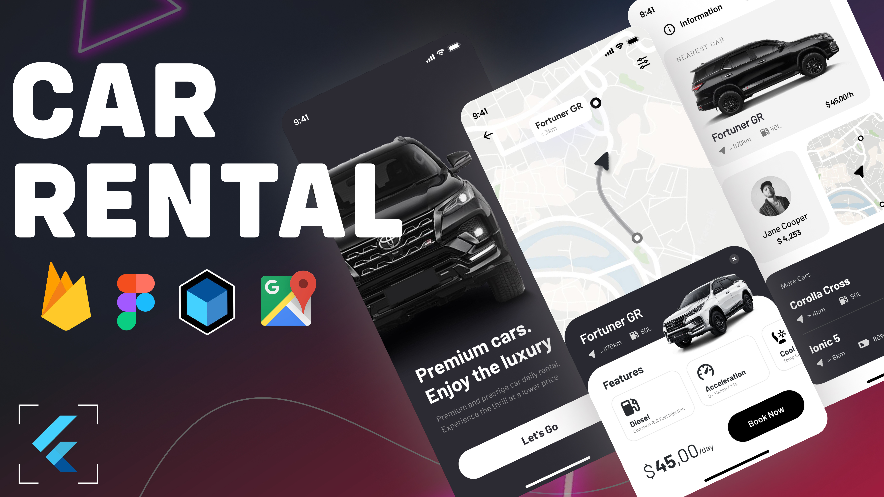

# Rentapp

This project is a car rental application developed using Flutter, Firebase, node js, Bloc, and Clean Architecture. It integrates openstreet Maps for enhanced functionality and user experience. The application provides a seamless and intuitive interface for users to book and manage car rentals. It can also be adapted for use in other rental service applications.

